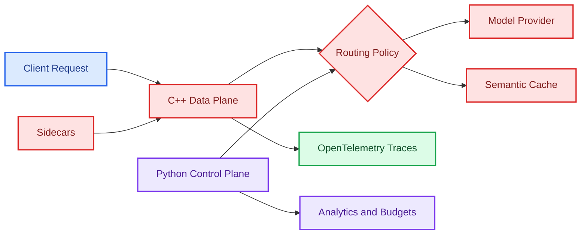

# Helix Gateway

<p align="center">
  
  
  
  
</p>

Helix Gateway is a high-performance LLM traffic gateway with a C++ data plane, Python control plane, semantic caching, cost-aware routing, and OpenTelemetry GenAI tracing. The project is organized like an infrastructure system: fast request path, policy APIs, benchmark workloads, deployment artifacts, and observability support.

## What It Demonstrates

- Low-latency C++ gateway design for LLM traffic.
- Control-plane APIs for tenants, routes, budgets, prompts, evals, and virtual keys.
- Semantic cache and routing concepts for model traffic optimization.
- Sidecar services for embeddings and guardrails.
- Benchmark tools for synthetic and replay-based workloads.
- Docker Compose deployment surfaces for local infrastructure.
- OpenTelemetry-oriented tracing and analytics structure.

## Architecture



## Repository Map

```text
data-plane/      C++ gateway implementation
control-plane/   Python APIs and control-plane services
benchmarks/      Mock OpenAI server and workload generators
deploy/          Docker Compose deployment examples
sidecars/        Embedder and guardrail sidecars
observability/   Telemetry and monitoring assets
docs/            Design and operational notes
```

## Local Development

```powershell
cd control-plane
python -m venv .venv
.\.venv\Scripts\Activate.ps1
pip install -e .
```

Deployment assets:

```powershell
cd ..\deploy
docker compose up --build
```

## Revision Notes

- Keep the data plane small and fast.
- Push configuration, analytics, and policy management into the control plane.
- Treat observability as a product feature for LLM infrastructure.
- Cache hits reduce cost and latency, but routing policy must protect correctness.

## Interview Talking Points

```text
The key design split is data plane versus control plane. The data plane should make
fast request decisions, while the control plane manages tenants, budgets, routing,
and analytics. This keeps the hot path lean while still supporting operational needs.
```
